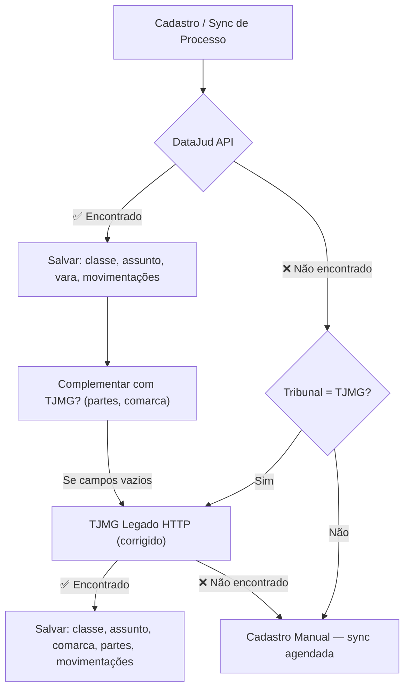

# Diagnóstico Técnico — Estratégia de Coleta de Dados Processuais

## 1. Como a Página Funciona

O sistema Moreira & Xavier utiliza **3 fontes de dados** para buscar informações de processos judiciais. A análise investigou cada uma ao vivo.

---

### Fonte 1: DataJud (API REST do CNJ) — ✅ PRINCIPAL

```
Fluxo: App → POST HTTP → ElasticSearch CNJ → JSON estruturado
```

- **Base URL:** `https://api-publica.datajud.cnj.jus.br`
- **Endpoint por tribunal:** `/{tribunal_alias}/_search` (ex: `/api_publica_tjmg/_search`)
- **Método:** POST
- **Auth:** Header `Authorization: APIKey <token>`
- **Corpo:** ElasticSearch Query DSL
- **Resposta:** JSON com dados completos do processo

**Dados disponíveis via DataJud:**
| Campo | Caminho JSON | Exemplo |
|-------|-------------|---------|
| Número CNJ | `hits.hits[0]._source.numeroProcesso` | `50149283620258130686` |
| Classe | `hits.hits[0]._source.classe.nome` | `Regulamentação de Visitas` |
| Assuntos | `hits.hits[0]._source.assuntos[].nome` | `Guarda` |
| Tribunal | `hits.hits[0]._source.tribunal` | `TJMG` |
| Órgão Julgador | `hits.hits[0]._source.orgaoJulgador.nome` | `1ª Vara de Família` |
| Data Ajuizamento | `hits.hits[0]._source.dataAjuizamento` | `2025-04-15T00:00:00` |
| Grau | `hits.hits[0]._source.grau` | `G1` |
| Movimentações | `hits.hits[0]._source.movimentos[]` | Array com código, nome, dataHora |

> [!IMPORTANT]
> **Status atual:** ✅ Funcionando em produção (Render). Confirmado via `/api/diagnostico` em 24/08/2026 com `httpStatus: 200`, `processoEncontrado: true`.

**Limitações:**
- Nem todo processo está indexado (processos recentes podem demorar dias/semanas)
- Não retorna partes (autor/réu) — campo inexistente na API pública
- Rate limit: ~1 req/s recomendado
- Não retorna comarca explicitamente

---

### Fonte 2: TJMG Consulta Processual (Sistema Legado JSP) — ⚠️ FALLBACK

```
Fluxo: App → POST HTTP → JSP Backend → HTML server-rendered
```

**Investigação ao vivo revelou:**

#### Tecnologia
- **Backend:** JavaServer Pages (JSP)
- **Frontend:** Vanilla JS, DWR (Direct Web Remoting) para captcha
- **Renderização:** 100% server-side — dados estão no HTML retornado, sem AJAX

#### Fluxo Real da Página (multi-step)
1. **Etapa 1** — `proc_complemento.jsp`: Usuário seleciona comarca via dropdown (ex: Teófilo Otôni = código `686`)
2. **Etapa 2** — `proc_massiva.jsp`: Usuário digita os primeiros 13 dígitos do CNJ (`5014928362025`) e clica "Adicionar"
   - JS valida dígito verificador via algoritmo módulo 97
   - JS monta o número completo: concatena `8.13` (TJMG) + código comarca (`0686`)
   - Adiciona à lista `lst_processos`
3. **Etapa 3** — `proc_resultado.jsp`: Submissão via **GET** com parâmetros:
   ```
   ?comrCodigo=686&numero=1&listaProcessos=50149283620258130686&btn_pesquisar=Pesquisar
   ```
4. **Resultado:** HTML completo com dados do processo em tabelas `<td>`

#### Captcha
- Sistema DWR (`ValidacaoCaptchaAction.exibirCaptcha()`) pode ser ativado
- Durante teste, **não foi ativado** (parece depender de volume de requisições)
- Risco: pode bloquear scraping automatizado

> [!WARNING]
> **Bug crítico no código atual:** O arquivo [`tjmg-api.client.ts`](file:///c:/Users/Freeitasfael/Desktop/antigravity/moreira%20e%20xavier/src/scrapers/tjmg/tjmg-api.client.ts) envia POST para `proc_resultado2.jsp` — mas a investigação ao vivo mostrou que:
> 1. O endpoint correto para resultado direto é `proc_resultado.jsp` (via **GET**, não POST)
> 2. O parâmetro `tipoConsulta` não existe nessa URL
> 3. Falta o parâmetro `comrCodigo` (código da comarca)
> 4. O parâmetro `natureza` não é reconhecido pelo endpoint

---

### Fonte 3: PJe Consulta Pública (RichFaces/JSF) — ❌ INVIÁVEL NO RENDER

```
Fluxo: App → Playwright → JSF/RichFaces → AJAX partial render → DOM parsing
```

**Investigação ao vivo revelou:**

#### Tecnologia
- **Framework:** JBoss RichFaces (JavaServer Faces - JSF)
- **JS:** jQuery 2.1.4, jQuery Mask Plugin
- **Captcha:** Google reCAPTCHA v2 (atualmente com bypass hardcoded: `if (false)`)
- **Comunicação:** AJAX assíncrono via `A4J.AJAX.Submit()` + polling a cada 90s

#### Input e Validação
- Campo: `#fPP:numProcesso-inputNumeroProcessoDecoration:numProcesso-inputNumeroProcesso`
- Máscara jQuery: `9999999-99.A999.J.TR.9999` (J=8, TR=13 hardcoded para TJMG)
- Validação client-side: `validaNumeroUnico()` com módulo 97
- Botão pesquisa: `#fPP:searchProcessos` → chama `executarReCaptcha()` → `executarPesquisa()`

#### Resultado
- Atualização parcial via RichFaces (`fPP:processosTable:tb`)
- Se não encontrar: tabela fica vazia (sem mensagem de erro)
- Dados carregados via AJAX, **não estão no HTML inicial**

> [!CAUTION]
> **Inviável no Render Free Tier:** Requer Playwright (headless browser), que consome ~500MB+ de RAM. O Render Free tem 512MB total.

---

## 2. Origem dos Dados — Mapeamento por Campo

| Campo | DataJud | TJMG Legado | PJe |
|-------|---------|-------------|-----|
| **Número CNJ** | ✅ `_source.numeroProcesso` | ✅ URL param | ✅ input mascarado |
| **Classe** | ✅ `_source.classe.nome` | ⚠️ regex HTML `Classe:` | ✅ `#classeJudicial` |
| **Assunto** | ✅ `_source.assuntos[].nome` | ⚠️ regex HTML `Assunto:` | ✅ `#assuntoProcesso` |
| **Comarca** | ❌ não disponível | ⚠️ regex HTML `Comarca:` | ✅ `#localidade` |
| **Vara/Órgão** | ✅ `_source.orgaoJulgador.nome` | ⚠️ regex HTML `Vara:` | ✅ `#orgaoJulgador` |
| **Parte Autora** | ❌ não disponível | ⚠️ regex HTML `Requerente:` | ✅ `[id*="poloAtivo"]` |
| **Parte Ré** | ❌ não disponível | ⚠️ regex HTML `Requerido:` | ✅ `[id*="poloPassivo"]` |
| **Movimentações** | ✅ `_source.movimentos[]` | ⚠️ regex tabela HTML | ✅ timeline DOM |
| **Data Ajuizamento** | ✅ `_source.dataAjuizamento` | ❌ | ❌ |
| **Valor da Causa** | ❌ | ⚠️ possível no HTML | ✅ |

---

## 3. Requisições Identificadas

| # | Fonte | Método | Endpoint | Parâmetros | Auth | Resposta |
|---|-------|--------|----------|------------|------|----------|
| 1 | DataJud | POST | `api-publica.datajud.cnj.jus.br/api_publica_tjmg/_search` | `{ query: { match: { numeroProcesso } }, size: 1 }` | `APIKey <token>` | JSON (ES) |
| 2 | TJMG Legado | GET | `www4.tjmg.jus.br/juridico/sf/proc_resultado.jsp` | `comrCodigo, numero, listaProcessos, btn_pesquisar` | Nenhuma (cookie de sessão possível) | HTML |
| 3 | PJe | POST (AJAX) | `pje-consulta-publica.tjmg.jus.br/` (JSF action) | `AJAXREQUEST`, form state, número processo | Cookie JSESSIONID | XML/HTML parcial |

---

## 4. Comportamentos Identificados

### Paginação
- **DataJud:** Usa `size` e `from` (ElasticSearch). Default `size: 1` para consulta individual. Máximo 10.000 hits.
- **TJMG Legado:** Sem paginação — retorna todos os resultados de uma vez
- **PJe:** RichFaces dataGrid com paginação server-side (30 resultados/página)

### Filtros
- **DataJud:** Query DSL do ElasticSearch permite filtros por tribunal, data, classe, etc.
- **TJMG Legado:** Filtro por comarca (obrigatório) e natureza (cível, criminal, etc.)
- **PJe:** Filtros por nome parte, OAB, classe, data

### Sessão/Cookies
- **DataJud:** Stateless — apenas API key no header
- **TJMG Legado:** Pode requerer cookie de sessão JSP (JSESSIONID) para captcha
- **PJe:** Requer JSESSIONID + ViewState do JSF

### Captcha
- **DataJud:** Nenhum
- **TJMG Legado:** DWR captcha (ativado por volume de requisições)
- **PJe:** reCAPTCHA v2 (atualmente bypassed com `if (false)`)

---

## 5. Riscos do Scraping Atual

### 🔴 Bug Crítico: TJMG API Client usa endpoint errado

O arquivo [`tjmg-api.client.ts:80`](file:///c:/Users/Freeitasfael/Desktop/antigravity/moreira%20e%20xavier/src/scrapers/tjmg/tjmg-api.client.ts#L80) faz:
```typescript
// ERRADO
fetch('https://www4.tjmg.jus.br/juridico/sf/proc_resultado2.jsp', {
  method: 'POST',
  body: new URLSearchParams({
    listaProcessos: numeroLimpo,
    natureza: '0',
    tipoConsulta: '1',
  })
})
```

**Problemas:**
1. O endpoint correto é `proc_resultado.jsp` (sem o "2"), via **GET**
2. Falta o parâmetro obrigatório `comrCodigo` (código da comarca)
3. Os parâmetros `natureza` e `tipoConsulta` não são aceitos por `proc_resultado2.jsp`
4. O método deveria ser GET, não POST

### 🔴 Parser HTML não corresponde à estrutura real

Os regex em [`tjmg-api.client.ts:169-212`](file:///c:/Users/Freeitasfael/Desktop/antigravity/moreira%20e%20xavier/src/scrapers/tjmg/tjmg-api.client.ts#L169-L212) tentam extrair dados com padrões como:
```regex
/Classe[:\s]*<\/td>\s*<td[^>]*>([^<]+)/i
```

Mas a investigação ao vivo mostrou que o HTML do TJMG legado usa uma estrutura diferente — os dados ficam em tabelas aninhadas com classes e IDs específicos, não no formato `label: </td><td>valor` assumido pelo regex.

### 🟡 Seletores CSS do PJe são especulativos

Os seletores em [`tjmg-consulta-publica.ts`](file:///c:/Users/Freeitasfael/Desktop/antigravity/moreira%20e%20xavier/src/scrapers/tjmg/tjmg-consulta-publica.ts) usam padrões genéricos:
```css
.movimentacao-item, .timeline-item, table.movimentacoes tr
```

A investigação mostrou que o PJe usa RichFaces com IDs como `fPP:processosTable:tb` — completamente diferentes dos seletores assumidos.

### 🟡 Dados parciais do DataJud

O DataJud **não retorna partes** (autor/réu) nem comarca. Esses campos ficam vazios mesmo quando o processo é encontrado.

### 🟢 DataJud funciona corretamente

Confirmado ao vivo: API key, endpoint, parsing, e persistência estão corretos. O processo `5014928-36.2025.8.13.0686` foi encontrado com classe "Regulamentação de Visitas".

---

## 6. Estratégia Recomendada

### ✅ Estratégia D — Híbrida (DataJud API + TJMG HTTP corrigido)



**Justificativa técnica:**

| Critério | DataJud | TJMG HTTP Corrigido | PJe (Playwright) |
|----------|---------|---------------------|-------------------|
| Confiabilidade | ⭐⭐⭐⭐⭐ | ⭐⭐⭐ | ⭐⭐ |
| Dados estruturados | ✅ JSON | ❌ HTML parsing | ❌ DOM parsing |
| Funciona no Render | ✅ | ✅ | ❌ |
| Sem captcha | ✅ | ⚠️ possível | ⚠️ reCAPTCHA |
| Partes (autor/réu) | ❌ | ✅ | ✅ |
| Comarca | ❌ | ✅ | ✅ |
| Movimentações | ✅ completas | ⚠️ parciais | ⚠️ parciais |

**DataJud é a fonte primária** por ser uma API REST estruturada, sem captcha, sem necessidade de browser, e com dados completos de movimentações.

**TJMG Legado serve como complemento** para os campos que o DataJud não fornece (partes, comarca), mas precisa ser reescrito com os endpoints e parâmetros corretos.

---

## 7. Plano de Implementação

### Etapa 1 — Corrigir o TJMG HTTP Client

Reescrever [`tjmg-api.client.ts`](file:///c:/Users/Freeitasfael/Desktop/antigravity/moreira%20e%20xavier/src/scrapers/tjmg/tjmg-api.client.ts) para:

1. Usar o endpoint correto: `proc_resultado.jsp` via **GET**
2. Incluir `comrCodigo` (extraído dos últimos 4 dígitos do CNJ)
3. Ajustar os parsers regex para a estrutura HTML real
4. Tratar o caso de captcha (retry com backoff, ou skip gracioso)

### Etapa 2 — Ajustar o ProcessoService

No [`processos.service.ts`](file:///c:/Users/Freeitasfael/Desktop/antigravity/moreira%20e%20xavier/src/modules/processos/processos.service.ts):

1. **Cadastro:** DataJud → se encontrou mas faltam partes/comarca → TJMG HTTP complementar
2. **Sync:** DataJud → se falhou → TJMG HTTP
3. Salvar a `fonte` usada para cada campo individualmente

### Etapa 3 — Remover código morto

- [`tjmg-consulta-publica.ts`](file:///c:/Users/Freeitasfael/Desktop/antigravity/moreira%20e%20xavier/src/scrapers/tjmg/tjmg-consulta-publica.ts) — requer Playwright, inviável no Render
- [`tjmg-autenticado.ts`](file:///c:/Users/Freeitasfael/Desktop/antigravity/moreira%20e%20xavier/src/scrapers/tjmg/tjmg-autenticado.ts) — requer Playwright, inviável no Render
- [`monitor-dje.ts`](file:///c:/Users/Freeitasfael/Desktop/antigravity/moreira%20e%20xavier/src/scrapers/tjmg/monitor-dje.ts) — requer Playwright, inviável no Render

### Etapa 4 — Endpoint de teste/validação

Manter/expandir o `/api/diagnostico` para testar ambas as fontes em produção.

---

## 8. Dados que Ainda Precisam Ser Descobertos

| Item | O que falta | Como descobrir |
|------|-------------|---------------|
| Estrutura HTML real do `proc_resultado.jsp` | Seletores exatos das tabelas de resultado | Fazer GET com processo conhecido e salvar o HTML para análise |
| Comportamento do captcha | Após quantas requisições é ativado? | Teste de volume controlado (5, 10, 20 requisições sequenciais) |
| Mapeamento comarca ↔ CNJ | Confirmar que os últimos 4 dígitos do CNJ sempre correspondem ao `comrCodigo` | Testar com processos de comarcas diferentes |
| Campos disponíveis no `proc_resultado.jsp` | Valor da causa, data distribuição, advogados | Analisar HTML retornado para um processo com dados completos |

---

## 9. Critérios de Validação

### Teste 1 — DataJud retorna dados completos
```
INPUT:  CNJ 5014928-36.2025.8.13.0686
EXPECT: classe ≠ null, orgaoJulgador ≠ null, movimentos.length > 0
STATUS: ✅ PASSOU (24/08/2026)
```

### Teste 2 — TJMG HTTP retorna dados complementares
```
INPUT:  CNJ 5014928-36.2025.8.13.0686, comrCodigo=0686
EXPECT: parteAutora ≠ null OU parteRe ≠ null OU comarca ≠ null
STATUS: ❓ PENDENTE (requer implementação corrigida)
```

### Teste 3 — Fluxo completo cadastro → dados preenchidos
```
INPUT:  Cadastrar processo novo via interface
EXPECT: Card mostra classe, vara, partes (não "Classe não informada")
STATUS: ❓ PENDENTE (requer Etapa 1 + 2)
```

### Teste 4 — Sincronização manual atualiza dados
```
INPUT:  Clicar "Sincronizar" em processo existente
EXPECT: Campos atualizados, movimentações > 0
STATUS: ❓ PENDENTE
```

### Teste 5 — Processo não encontrado em nenhuma fonte
```
INPUT:  CNJ fictício (ex: 9999999-99.9999.9.99.9999)
EXPECT: Toast "Processo cadastrado para acompanhamento manual", sem erro
STATUS: ✅ PASSOU (comportamento já implementado)
```
